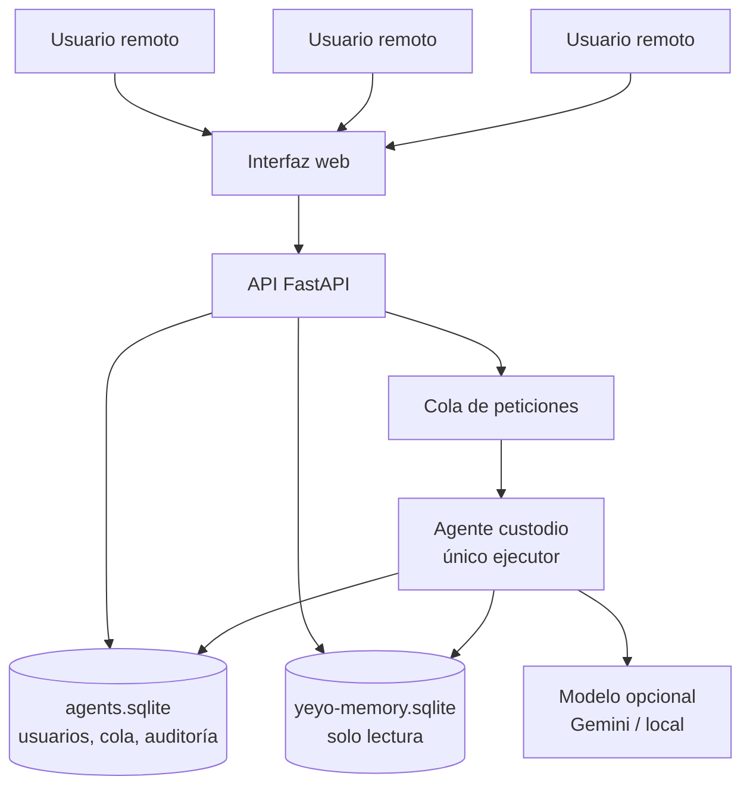

# Arquitectura propuesta

## Principio de diseño

El repositorio documental no se convierte en un buzón abierto para varios escritores. La memoria documental queda como base de conocimiento controlada y el trabajo colaborativo se canaliza mediante una cola.

Esto permite:

- evitar escrituras concurrentes sobre la memoria,
- auditar quién pidió qué,
- repetir o revisar respuestas,
- limitar qué contexto sale hacia un modelo externo,
- mantener un modo completamente local si no hay clave de IA.

## Agentes

### Agente custodio

Responsable de:

- procesar la cola,
- recuperar contexto,
- consultar IA si está configurada,
- devolver respuestas con fuentes,
- registrar auditoría,
- ejecutar futuras tareas de curación.

Es el único componente que debería tener permiso de escritura sobre memoria enriquecida si más adelante se habilita clasificación persistente.

### Agentes solicitantes

Son usuarios o automatismos con permisos limitados:

- hacen búsquedas,
- crean peticiones,
- revisan resultados,
- no modifican directamente la base documental.

## Modo actual

La versión actual deja la memoria documental en solo lectura y guarda la actividad multiusuario en una base separada. Esto es intencionado para el piloto.

## Modo futuro

Cuando se quiera permitir curación persistente, añadir una tabla de propuestas:

- `classification_proposals`
- `document_notes`
- `approved_reuse_candidates`

El custodio puede escribir ahí, no sobre los documentos originales.
