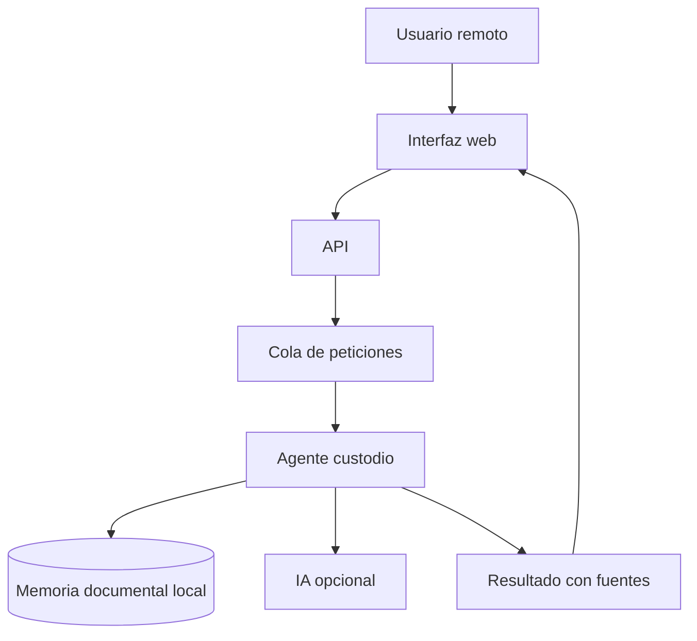

# Propuesta de sistema multiagente para gestión documental IA

## Objetivo

Crear una herramienta web para que varias personas puedan consultar en remoto una base documental de ingeniería, usando IA solo como capa de ayuda y manteniendo el máximo procesamiento en local.

El sistema no redacta el proyecto automáticamente. Su función es localizar, filtrar, comparar y justificar documentación reutilizable para:

- Memoria y Anejos.
- Planos.
- Pliego de Condiciones.
- Mediciones y presupuestos.

## Enfoque

La arquitectura propuesta usa un único agente custodio. Este agente es el responsable de consultar la memoria documental, procesar peticiones y registrar resultados. El resto de personas o agentes no modifican directamente la base: envían peticiones.

Esto reduce riesgos en trabajo remoto:

- no hay escrituras simultáneas sobre la memoria,
- todas las peticiones quedan auditadas,
- se puede controlar qué contexto se envía a un modelo externo,
- se puede trabajar sin IA externa en modo local extractivo,
- se puede escalar luego a Gemini, OpenAI u Ollama.

## Estado implementado

Se ha creado la carpeta:

```text
.yeyo-agents/
```

Contiene:

- Backend FastAPI.
- Interfaz web.
- Gestión de usuarios por token.
- Roles `viewer`, `curator` y `admin`.
- Cola de peticiones.
- Agente custodio.
- Auditoría.
- Integración opcional con Google Gemini.
- Modo local sin backend externo.
- Servicios `systemd` para Linux.

## Flujo de trabajo



## Bases de datos

La base documental existente queda en solo lectura:

```text
.yeyo-memory/sqlite/yeyo-memory.sqlite
```

La actividad multiusuario se guarda aparte:

```text
.yeyo-agents/data/agents.sqlite
```

Esto separa el conocimiento documental de la operación diaria.

## Despliegue recomendado

Servidor Linux pequeño:

- 4 vCPU.
- 16 GB RAM.
- Disco SSD suficiente para el repositorio documental.
- Ubuntu Server LTS.
- Python 3.11/3.12.
- Acceso por VPN o HTTPS con proxy inverso.

Para 5 usuarios, no hace falta una infraestructura grande. Lo importante es controlar el acceso y las copias de seguridad.

## Modelo IA

Tres modos posibles:

1. **Local extractivo**
   - Sin coste de API.
   - No envía información fuera.
   - Sirve para piloto y búsqueda con evidencias.

2. **Google Gemini**
   - Se envían solo fragmentos recuperados localmente.
   - Recomendado para respuestas redactadas.
   - Modelo sugerido: `gemini-3.5-flash`.

3. **Modelo local**
   - Ollama o similar en el servidor.
   - Más privacidad.
   - Menor calidad que modelos cloud potentes, dependiendo del hardware.

## Siguiente iteración recomendada

Añadir una segunda memoria con proyectos propios ya redactados. Esa memoria serviría como patrón para clasificar el repositorio recibido según la estructura real de INGECEX:

- qué se parece a una memoria,
- qué puede servir como anejo,
- qué pertenece a pliego,
- qué partidas de medición son reutilizables,
- qué planos son solo referencia y cuáles son aprovechables.

Después, el agente custodio podría responder consultas como:

```text
Encuentra documentación reutilizable para el anejo de tuberías HTF y ordénala por aplicabilidad.
```

O:

```text
Compara este pliego propio con el repositorio recibido y señala cláusulas o documentos candidatos.
```

## Riesgos y controles

- **Privacidad**: usar VPN y enviar a IA solo fragmentos, nunca documentos completos.
- **Trazabilidad**: exigir siempre fuentes y rutas documentales.
- **Calidad**: las respuestas deben ser candidatas, no verdades finales.
- **Coste**: mantener búsqueda y OCR en local; usar IA solo sobre contexto reducido.
- **Concurrencia**: mantener un único custodio escritor y cola secuencial.
